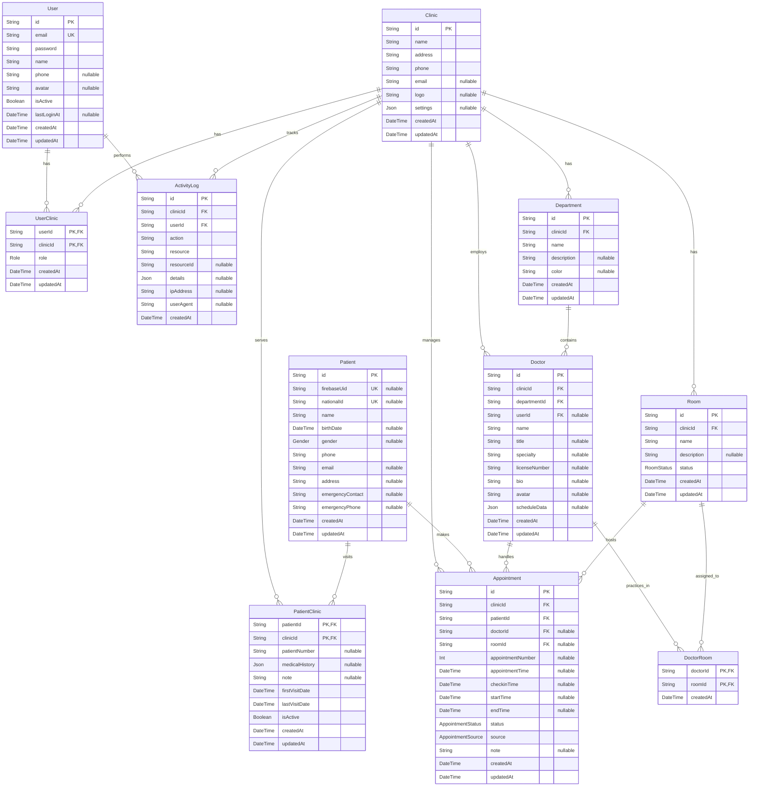
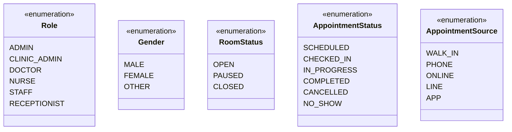
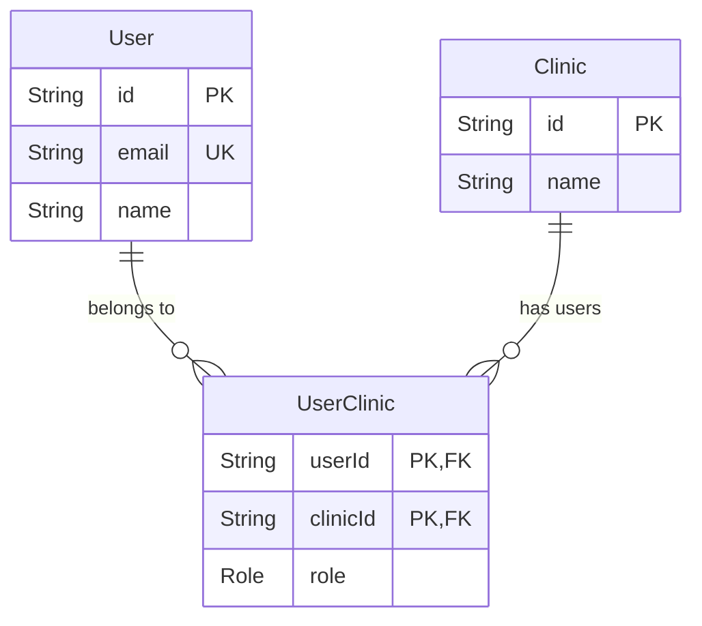
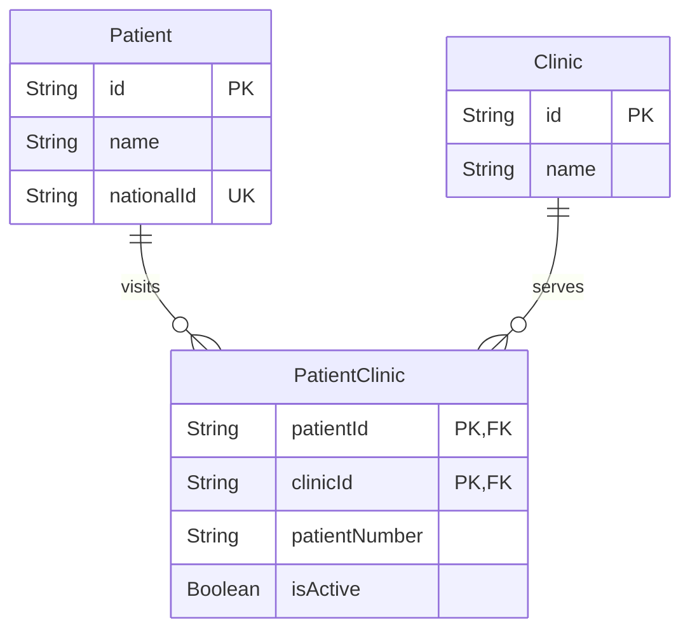
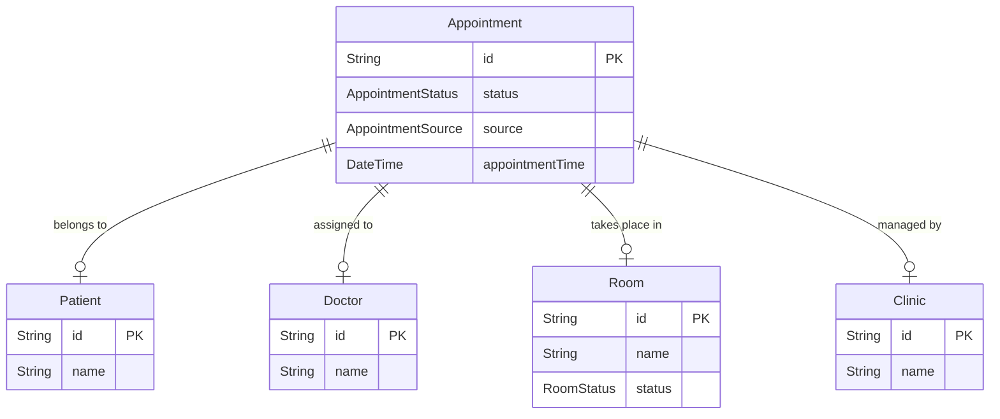
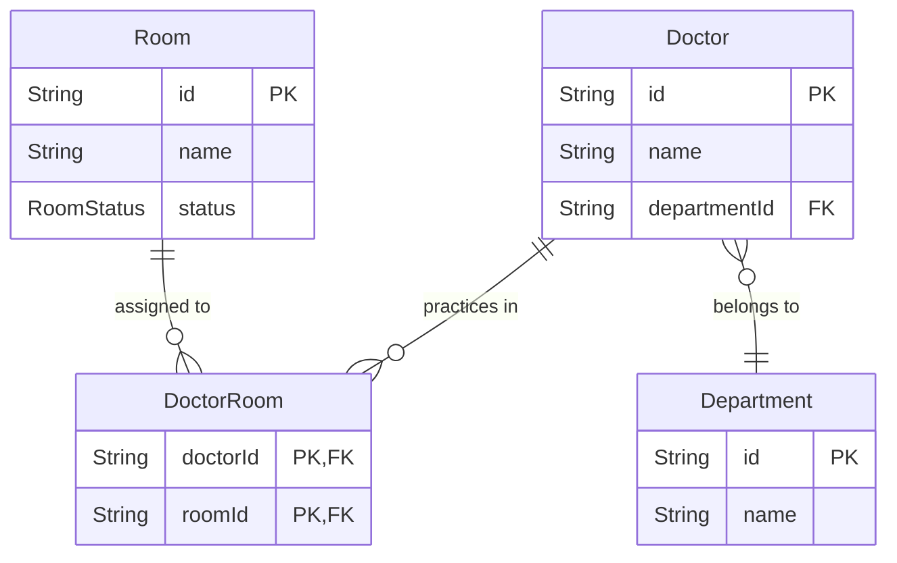

# 診所管理整合系統 Clinic Link

一個綜合性的診所管理平台，專為台灣的診所設計，整合了線上預約、現場掛號和看診進度追蹤功能，提升工作效率和病患體驗。

## 技術架構

### 前端架構
- **框架**：React 18 + TypeScript
- **狀態管理**：TanStack Query (React Query v5)
- **路由**：React Router v6
- **UI設計**：Tailwind CSS + shadcn/ui 元件
- **表單處理**：React Hook Form + Zod 驗證
- **開發工具**：Vite, ESLint, Prettier

### 後端架構
- **語言框架**：Node.js + NestJS + TypeScript
- **認證**：Firebase Auth + JWT 授權機制 + Auth Guards
- **即時通訊**：MQTT協議
- **MQTT Broker**：Mosquitto/EMQ X
- **ORM**：Prisma
- **API 文件**：Swagger/OpenAPI
- **架構模式**：Clean Architecture

### 資料庫架構
- **主要資料庫**：PostgreSQL
- **多租戶設計**：基於 clinic_id 的隔離架構
- **關聯模型**：使用外鍵保持資料完整性
- **快取層**：Redis

### 部署與 DevOps
- **容器化**：Docker + Docker Compose
- **CI/CD**：GitHub Actions
- **監控**：Prometheus + Grafana
- **日誌管理**：ELK Stack (Elasticsearch, Logstash, Kibana)

## 資料模型設計

### 資料庫架構圖





### Enum 類別圖


### 簡化版核心關係圖

```mermaid
erDiagram
    Clinic ||--o{ User : "employs"
    Clinic ||--o{ Patient : "serves"
    Clinic ||--o{ Appointment : "manages"
    User ||--o{ Appointment : "handles"
    Patient ||--o{ Appointment : "makes"
    
    Clinic {
        id PK
        name
        address
    }
    
    User {
        id PK
        email UK
        role
    }
    
    Patient {
        id PK
        name
        phone
    }
    
    Appointment {
        id PK
        status
        appointmentTime
    }
```

### 使用者與診所關係圖



### 病患與診所關係圖



### 預約系統關係圖



### 醫生與診間關係圖



## 後端 Clean Architecture 架構設計

### 架構概念

本系統採用 Clean Architecture (整潔架構) 進行設計，將應用程式按層級分離而非按業務領域分組。這種設計確保了架構邊界清晰，讓系統更加關注於層級之間的依賴關係。

整個應用程式分為四個主要層級：

1. **Domain 層** - 業務核心，包含業務實體、規則和介面定義
2. **Use Cases 層** - 應用程式特定業務邏輯，協調領域實體
3. **Presentation 層** - 處理外部輸入和輸出，如 API 控制器、MQTT 等
4. **Infrastructure 層** - 實現技術細節，如資料庫存取、外部服務等

### 層級架構與職責

#### Domain 層

Domain 層是整個系統的核心，包含業務實體、值物件、領域事件和業務規則。這一層是獨立的，不依賴於任何外部框架或技術細節。

**資料夾結構**:
```
src/
└── domain/
    ├── common/                     # 通用領域元素
    │   ├── entities/               # 基礎實體類
    │   ├── value_objects/          # 值物件
    │   └── interfaces/             # 通用介面
    │
    ├── appointments/               # 預約領域
    │   ├── entities/               # 預約實體
    │   ├── value_objects/          # 預約相關值物件
    │   ├── events/                 # 領域事件
    │   ├── interfaces/             # 領域介面，如儲存庫介面
    │   └── exceptions/             # 領域例外
    │
    ├── clinics/                    # 診所領域
    ├── patients/                   # 病患領域
    ├── doctors/                    # 醫生領域
    ├── rooms/                      # 診間領域
    └── users/                      # 使用者領域
```

**主要職責**:
- 定義業務實體與值物件
- 定義業務規則與驗證邏輯
- 定義領域事件
- 定義領域服務介面
- 不依賴任何框架或外部技術

#### Use Cases 層

Use Cases 層包含應用程式的特定業務邏輯，協調領域實體完成特定的業務流程。此層實現了系統的功能需求。

**資料夾結構**:
```
src/
└── usecases/
    ├── common/                     # 通用使用案例元素
    │   ├── interfaces/             # 使用案例介面
    │   └── base/                   # 基礎使用案例類
    │
    ├── appointments/               # 預約使用案例
    │   ├── commands/               # 命令處理
    │   │   ├── create_appointment/ # 建立預約命令
    │   │   │   ├── create_appointment.command.ts  # 命令定義
    │   │   │   ├── create_appointment.handler.ts  # 命令處理器
    │   │   │   └── create_appointment.response.ts # 命令回應
    │   │   ├── update_appointment/ # 更新預約命令
    │   │   └── cancel_appointment/ # 取消預約命令
    │   │
    │   └── queries/                # 查詢處理
    │       ├── get_appointments/   # 取得預約列表查詢
    │       │   ├── get_appointments.query.ts      # 查詢定義
    │       │   ├── get_appointments.handler.ts    # 查詢處理器
    │       │   └── get_appointments.response.ts   # 查詢回應
    │       └── get_appointment/    # 取得單一預約查詢
    │
    ├── clinics/                    # 診所使用案例
    ├── patients/                   # 病患使用案例
    ├── doctors/                    # 醫生使用案例
    ├── rooms/                      # 診間使用案例
    └── users/                      # 使用者使用案例
```

**主要職責**:
- 實現應用程式的業務邏輯
- 協調領域實體完成特定業務流程
- 執行輸入驗證和業務規則檢查
- 處理領域事件
- 只依賴領域層，不依賴外部技術

#### Presentation 層

Presentation 層負責處理用戶輸入和輸出，提供系統的對外介面。這一層包含 REST API 控制器、MQTT 網關等與外部系統的通訊介面。

**資料夾結構**:
```
src/
└── presentation/
    ├── common/                     # 通用表示層元素
    │   ├── base.controller.ts      # 基礎控制器
    │   ├── filters/                # 異常過濾器
    │   ├── interceptors/           # 攔截器
    │   └── decorators/             # 自定義裝飾器
    │
    ├── rest/                       # REST API 控制器
    │   ├── appointments/           # 預約相關 API
    │   ├── clinics/                # 診所相關 API
    │   ├── patients/               # 病患相關 API
    │   ├── doctors/                # 醫生相關 API
    │   ├── rooms/                  # 診間相關 API
    │   └── users/                  # 使用者相關 API
    │
    └── mqtt/                       # MQTT 網關
        ├── common/                 # 通用 MQTT 元素
        ├── appointments/           # 預約相關 MQTT 網關
        ├── rooms/                  # 診間相關 MQTT 網關
        └── notifications/          # 通知相關 MQTT 網關
```

**主要職責**:
- 處理HTTP請求和回應
- 處理MQTT消息發送和接收
- 進行請求參數驗證
- 將請求轉換為使用案例命令或查詢
- 將領域資料轉換為 API 回應格式

#### Infrastructure 層

Infrastructure 層實現與外部系統和框架的整合，包括資料庫存取、外部服務整合、認證服務等。

**資料夾結構**:
```
src/
└── infrastructure/
    ├── common/                     # 通用基礎設施元素
    │   ├── database/               # 資料庫相關
    │   │   └── prisma/             # Prisma ORM 設定
    │   ├── services/               # 共用服務
    │   └── adapters/               # 外部服務適配器
    │
    ├── auth/                       # 認證相關
    │   ├── services/               # 認證服務
    │   ├── guards/                 # 認證守衛
    │   ├── strategies/             # 認證策略
    │   └── decorators/             # 認證裝飾器
    │
    ├── repositories/               # 資料庫存取實現
    │   ├── appointments/           # 預約儲存庫
    │   ├── clinics/                # 診所儲存庫
    │   ├── patients/               # 病患儲存庫
    │   ├── doctors/                # 醫生儲存庫
    │   ├── rooms/                  # 診間儲存庫
    │   └── users/                  # 使用者儲存庫
    │
    ├── mappers/                    # 資料映射器
    │   ├── appointment.mapper.ts
    │   ├── clinic.mapper.ts
    │   └── ...
    │
    └── external_services/          # 外部服務整合
        ├── notification/           # 通知服務
        └── firebase/               # Firebase 服務
```

**主要職責**:
- 實現儲存庫介面
- 提供資料庫存取功能
- 整合外部服務和 API
- 處理技術細節和框架整合
- 提供基礎設施服務，如日誌記錄、事件發佈等

### 應用程式模組

為了按功能組織 NestJS 模組，我們在根目錄下設立 `app` 資料夾，包含各個功能模組的定義。

**資料夾結構**:
```
src/
└── app/
    ├── appointments/               # 預約模組
    │   └── appointments.module.ts
    ├── clinics/                    # 診所模組
    ├── patients/                   # 病患模組
    ├── doctors/                    # 醫生模組
    ├── rooms/                      # 診間模組
    └── users/                      # 使用者模組
```

### 依賴規則

Clean Architecture 的核心原則是依賴規則，外層可以依賴內層，但內層不能依賴外層：

1. **Domain 層** 不依賴任何其他層
2. **Use Cases 層** 只依賴 Domain 層
3. **Presentation 層** 依賴 Use Cases 層和 Domain 層
4. **Infrastructure 層** 依賴 Domain 層，實現 Domain 層定義的介面

### 資料流動

在 Clean Architecture 中，資料的流動遵循以下模式：

1. 外部請求 → Presentation 層控制器
2. 控制器將請求轉換為 Use Case 命令/查詢
3. Use Case 執行業務邏輯，透過儲存庫介面存取數據
4. Infrastructure 層實現儲存庫介面，與資料庫交互
5. 資料按相反方向返回：資料庫 → 儲存庫 → Use Case → 控制器 → 回應

### 依賴注入

使用 NestJS 的依賴注入系統來實現控制反轉原則：

```typescript
// 在模組中配置依賴注入
@Module({
  providers: [
    // Use Cases
    CreateAppointmentHandler,
    GetAppointmentsHandler,
    
    // 將 Infrastructure 層實現注入到 Domain 層介面
    {
      provide: 'IAppointmentRepository',
      useClass: PrismaAppointmentRepository,
    },
    
    // 映射器
    AppointmentMapper,
    
    // 其他服務
    PrismaService,
  ],
  controllers: [AppointmentsController],
})
export class AppointmentsModule {}
```

### 模組間通訊

使用 NestJS 的事件系統（基於 CQRS 模式）進行模組間的解耦通訊：

1. 領域事件由 Domain 層定義
2. Use Cases 層發佈事件
3. 其他 Use Cases 可以訂閱並處理這些事件

## 前端實作架構 (React + TypeScript)

### 資料夾結構

```
src/
├── main.tsx                        # 應用入口點
├── App.tsx                         # 主應用元件
├── assets/                         # 靜態資源
├── components/                     # 共用元件
│   ├── ui/                         # UI 元件 (shadcn/ui)
│   ├── layout/                     # 布局元件
│   ├── form/                       # 表單元件
│   └── data_display/               # 資料展示元件
├── context/                        # React Context
│   ├── auth_context.tsx            # 認證上下文
│   └── clinic_context.tsx          # 診所上下文
├── features/                       # 功能模組
│   ├── auth/                       # 認證功能
│   ├── dashboard/                  # 儀表板
│   ├── patients/                   # 病患管理
│   ├── appointments/               # 預約管理
│   ├── doctors/                    # 醫生管理
│   ├── rooms/                      # 診間管理
│   └── settings/                   # 系統設定
├── hooks/                          # 自定義 Hooks
│   ├── use_auth.ts                 # 認證 Hook
│   ├── use_clinic.ts               # 診所 Hook
│   ├── use_mqtt.ts                 # mqtt Hook
│   └── use_permission.ts           # 權限檢查 Hook
├── lib/                            # 工具庫
│   ├── api.ts                      # API 客戶端
│   ├── mqtt.ts                     # MQTT 客戶端
│   ├── utils.ts                    # 工具函數
│   └── validators.ts               # 表單驗證
├── routes/                         # 路由設定
│   └── index.tsx                   # 路由定義
├── services/                       # 服務層
│   ├── auth_service.ts             # 認證服務
│   ├── patient_service.ts          # 病患服務
│   └── appointment_service.ts      # 預約服務
├── store/                          # 狀態管理
│   └── queries/                    # React Query
├── types/                          # TypeScript 型別定義
│   ├── auth.types.ts               # 認證相關型別
│   ├── clinic.types.ts             # 診所相關型別
│   └── api.types.ts                # API 相關型別
└── utils/                          # 工具函數
    ├── date_utils.ts               # 日期處理
    ├── format_utils.ts             # 格式化工具
    └── permission_utils.ts         # 權限相關工具
```

## 身分驗證架構

### 認證流程
1. **多平台登入整合**：使用 Firebase Authentication 支援多種登入方式（Google、Facebook、Email/密碼、手機驗證）
2. **身分驗證流程**：
   - 前端通過 Firebase 完成身分驗證，獲取 Firebase ID token
   - 將 Firebase token 發送至後端
   - 後端使用 Firebase Admin SDK 驗證 token 真實性
   - 驗證成功後，系統生成內部 JWT token 並返回給前端
   - 後續請求使用內部 JWT 進行身分驗證

### 技術實現
- **前端**：Firebase Authentication SDK
- **後端**：
  - Firebase Admin SDK 驗證外部身分
  - NestJS JWT Guard 處理內部身分驗證
  - Custom Auth Guards 處理權限控制

### 未來擴展計劃
- 當用戶數增長時，計劃將身分驗證服務遷移至 Supabase
- 遷移策略將確保向後兼容，用戶無感知切換

## 資料庫架構與存取策略

### 主要資料庫
- **PostgreSQL**：作為唯一的持久化儲存

### 資料庫存取層
- **Prisma ORM**：作為唯一的資料庫存取層，處理所有資料庫操作
- **Repository 模式**：實現領域與資料存取的解耦
  - 定義抽象的 Repository 介面
  - 使用 Prisma 實現具體的 Repository

### Firebase/Supabase 與資料層的關係
- **僅用於身分驗證**：Firebase/Supabase 僅作為身分提供者
- **用戶資料同步**：Firebase 認證成功後，用戶基本資訊同步至 PostgreSQL
- **資料隔離**：認證服務與業務資料完全分離，確保系統靈活性

## 即時通訊功能

系統使用 MQTT 提供即時更新:

- **候診隊列更新**：病患候診狀態即時推送
- **診間狀態變更**：診間開/關診狀態即時更新
- **到診提醒**：病患到診時通知櫃檯和醫生
- **跨裝置支援**：網頁前端、Flutter行動應用程式和ESP32顯示看板
- **主題結構**：使用`cms/clinic/{clinic_id}/...`結構確保資料隔離

### MQTT 與 Socket 的使用場景
- **MQTT**：用於廣播性質的實時消息，如候診隊列更新、診間狀態變更
- **WebSocket** (未實現)：保留未來用於點對點通訊功能的可能性

## 多診所管理架構

- **使用者可屬於多家診所**：一個使用者可以在不同診所擔任不同角色
- **診所上下文**：所有操作都在特定診所上下文中進行
- **資料隔離**：不同診所的資料完全隔離

## 患者管理架構

### 多診所患者系統

系統支援患者在多個診所就診的需求，採用以下設計：

- **全域患者資料**：患者基本資料（姓名、生日、聯絡方式等）全系統共用
- **診所特定資料**：每個診所可以維護自己的病歷號碼、病史記錄等
- **Firebase 認證**：患者使用統一的 Firebase 帳號登入，可以存取所有相關診所的資料

### 患者-診所關聯

- 透過 `PatientClinic` 關聯表管理患者與診所的關係
- 每個患者在不同診所可以有不同的病歷號碼
- 保持醫療記錄的隱私性和資料隔離

### 患者認證流程

1. **Firebase 手機認證**：患者使用手機號碼進行 Firebase 認證
2. **患者註冊**：首次使用時填寫基本資料，資料儲存在 PostgreSQL
3. **診所關聯**：患者首次到診所就診時，自動建立與該診所的關聯
4. **跨診所存取**：患者可以在 App 中查看和管理多個診所的就診記錄


## 測試策略與實踐

### TDD 開發流程
1. **紅階段**：先編寫失敗的測試，明確需求
2. **綠階段**：實現最小可行代碼，使測試通過
3. **重構階段**：改進代碼質量，確保測試仍然通過

### 測試分層策略
- **單元測試**：
  - 覆蓋率目標：90%+ 的業務邏輯代碼
  - 主要工具：Jest
  - 重點測試：Domain 和 Usecase 層
  - 獨立測試：使用 Mock 和 Stub 隔離外部依賴

- **整合測試**：
  - 覆蓋率目標：80%+ 的關鍵流程
  - 測試範圍：Repository 實現、外部服務整合
  - 測試策略：使用 TestContainer 提供隔離的測試環境

- **端到端測試**：
  - 覆蓋關鍵業務流程
  - 工具：Cypress (前端)、Supertest (API)
  - 自動化運行：CI/CD 流程的一部分

### 測試檔案結構
- 測試文件與源文件位置平行
- 單元測試：`*.spec.ts`
- 整合測試：`*.integration.spec.ts`
- 端到端測試：`*.e2e.spec.ts`

### 持續集成
- 每次 PR 自動運行單元和整合測試
- 主分支合併前運行完整測試套件
- 測試報告和覆蓋率報告自動生成

### 測試最佳實踐
- 使用工廠模式創建測試對象
- 採用 Given-When-Then 風格編寫測試
- 建立共享的測試工具和 Fixtures
- 定期進行測試代碼審查

## 系統性能與擴展性考量

### 性能優化策略
- **資料庫查詢優化**：
  - 適當索引設計（參見 Prisma Schema 中的 @@index 定義）
  - 複雜查詢分析與優化
  - 使用 Prisma 的查詢合併功能減少數據庫往返

- **緩存策略**：
  - Redis 用於緩存頻繁訪問的數據（候診隊列、醫生排班）
  - 實現多級緩存：Memory Cache → Redis → Database
  - 緩存失效策略：基於時間和事件的混合策略

- **前端性能**：
  - 實現組件懶加載
  - 使用 React.memo 和 useMemo 減少不必要的重渲染
  - 使用虛擬滾動處理大量數據顯示